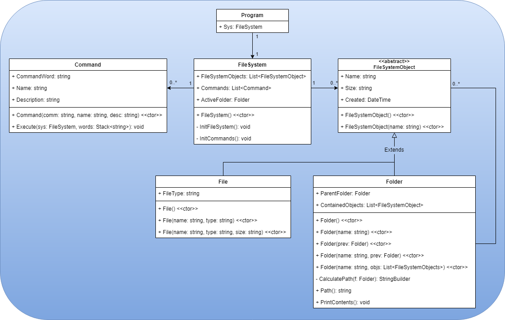

# 
Custom File System

This project is a C# Console Application that simulates a File System.  Users can add, remove, and rename files and folders.  C# classes represent the files and folders that the user changes.  If a user wants to know what commands they can use, they can type in `help` to see a list of all commands.  You can even type in `help add` to see how to use the `add` command, for example.  Below you can take a look at the UML Class diagram that I created using draw.io.

*contents*

**[UML class Diagram](#uml-class-diagram) • [Program](#Program) • [File System](#file-system) • [Command](#command) • [File System Object](#fso) • [File](#file) • [Folder](#folder)**

| **
Technologies/Skills Used
** |
| --- |
| **C# • OOP • UML • Recursion • Data Structures** |

*UML class diagram*

## 
File System Object
